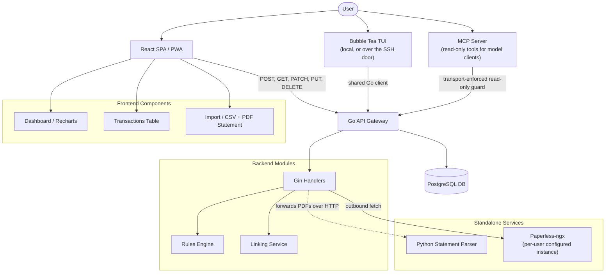
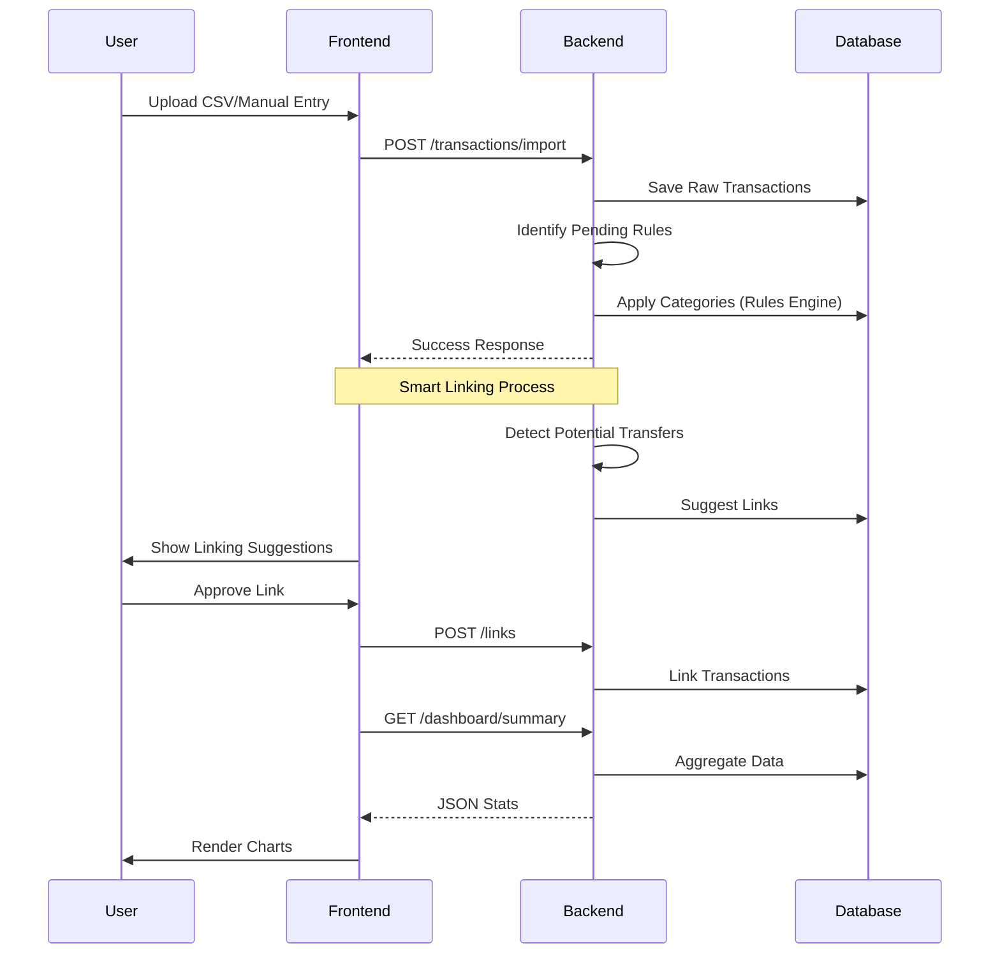
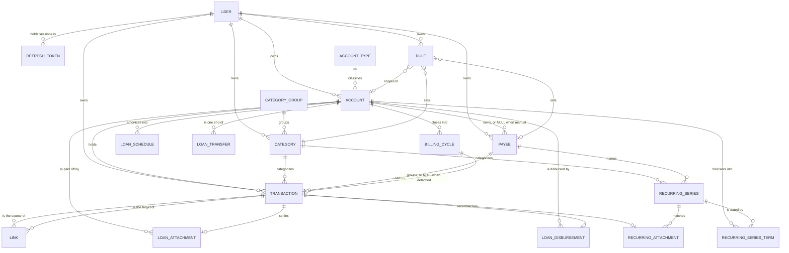

# 📊 FinTrak System Flowchart

This document visualizes the core architecture and transaction lifecycle of the FinTrak application.

## 🏗️ System Architecture

## 💸 Transaction Lifecycle

## 🛠️ Data Model Relationships

Every table except `account_types` is tenant-scoped by `user_id`; the `USER`
edges above name the owning roots rather than repeat all eighteen. Two things
this diagram cannot draw: `transactions.tags` is a `TEXT[]` column, not a
table, and `transactions.amount` is integer minor units of the owning
account's `currency` — a transaction has no currency column of its own.
`recurring_series_terms.user_id` and `rules.filter_category_id` /
`filter_payee_id` are set but not constrained by a foreign key.
