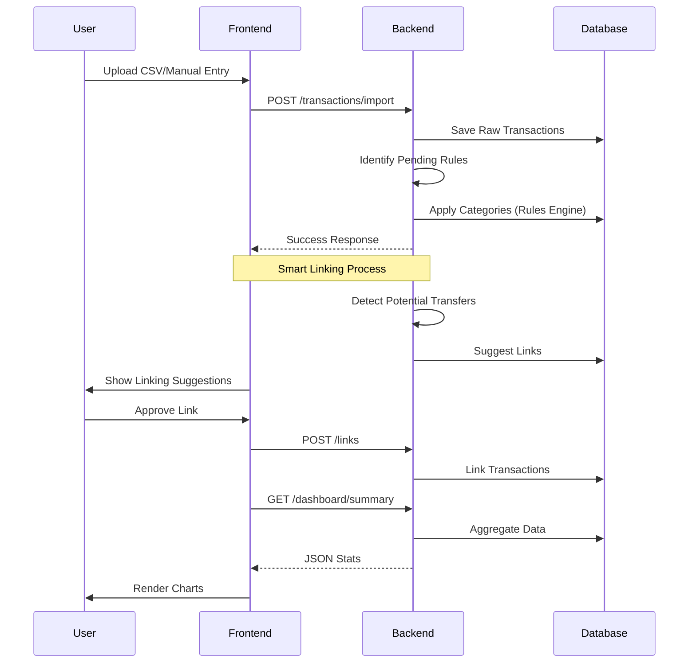
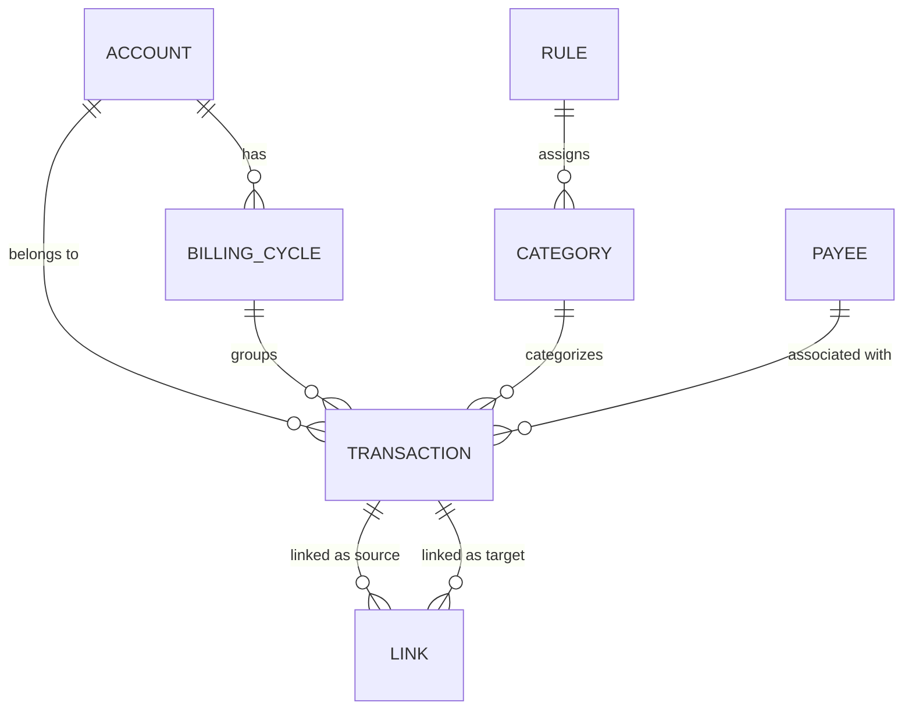

# 📊 FinTrak System Flowchart

This document visualizes the core architecture and transaction lifecycle of the FinTrak application.

## 🏗️ System Architecture

```mermaid
graph TD
    User([User]) <--> Frontend[React Frontend]
    Frontend <--> API[Go API Gateway]
    API <--> PostgreSQL[(PostgreSQL DB)]
    API <--> Parser[Statement Parser Service]

    subgraph "Frontend Components"
        Dashboard[Dashboard / Recharts]
        Transactions[Transactions Table]
        Import[Import / CSV + PDF Statement]
    end

    subgraph "Backend Modules"
        Handlers[Gin Handlers]
        RulesEngine[Rules Engine]
        LinkingService[Linking Service]
    end

    subgraph "Standalone Services"
        Parser[Python Statement Parser]
    end

    Frontend --- Dashboard
    Frontend --- Transactions
    Frontend --- Import

    API --- Handlers
    Handlers --- RulesEngine
    Handlers --- LinkingService
    Handlers -. forwards PDFs via HTTP .-> Parser
```

## 💸 Transaction Lifecycle

## 🛠️ Data Model Relationships

